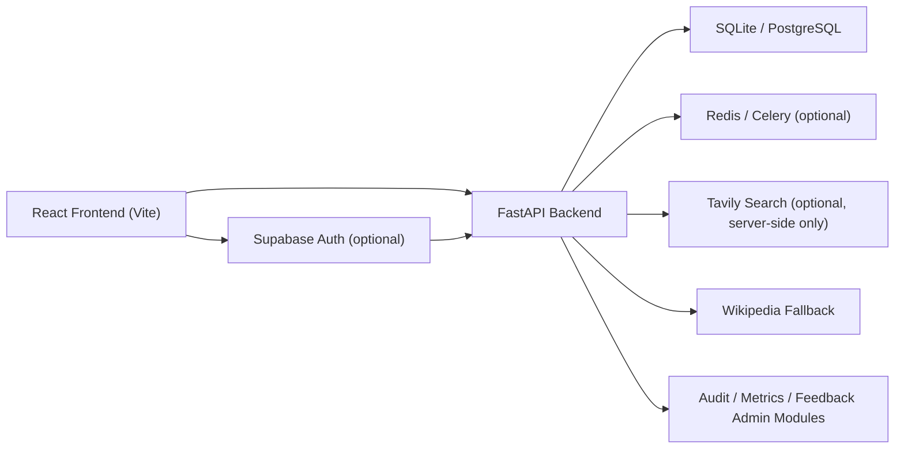
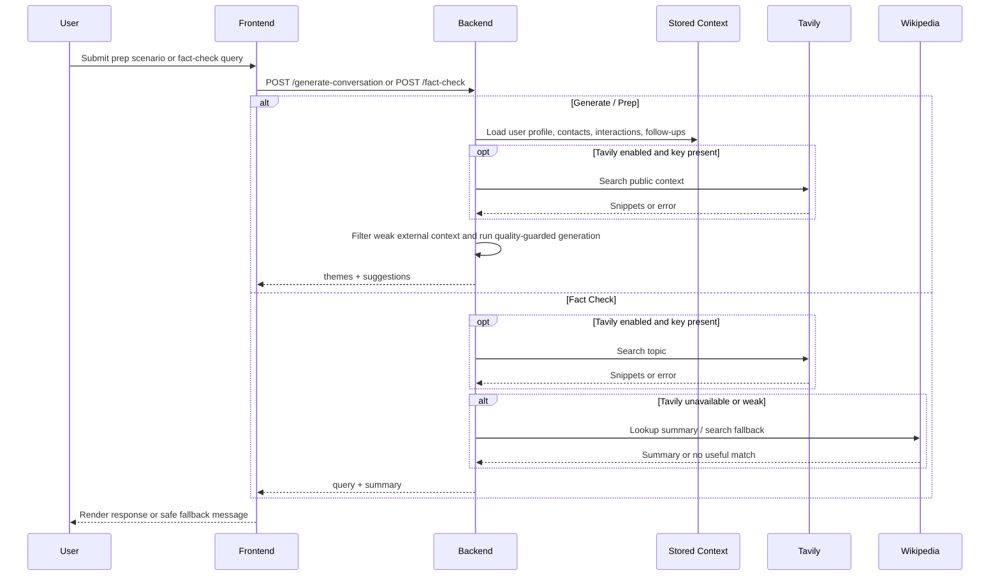

# Nexora

Nexora is an AI-assisted networking workspace for managing contacts, follow-ups, event prep, recommendations, and admin-side product signals in one full-stack app.

## Live Project

- Repository: [ayushxt25/Nexora](https://github.com/ayushxt25/Nexora)
- Live Demo: Not deployed yet

## What Nexora Does

Nexora helps users organize professional relationships, prepare for conversations, surface follow-up opportunities, and inspect system behavior through a dedicated developer console. The backend exposes authenticated APIs for contacts, events, follow-ups, analytics, graph insights, recommendations, opportunities, feedback, and AI-powered prep workflows. The frontend packages those APIs into a polished React dashboard with optional Supabase auth support.

## Key Features

- Authenticated FastAPI backend with legacy JWT auth and optional Supabase-based auth mode
- React + Vite frontend with dashboard, CRM flows, analytics, graph views, prep tools, and admin utilities
- Contact, event, interaction, follow-up, profile, recommendation, opportunity, and lifecycle APIs
- Relationship Prep workflow with generated conversation starters, quality guards, history logging, and feedback capture
- Fact Check workflow with optional Tavily-backed search and safe Wikipedia fallback
- Optional Tavily public-context enrichment for Prep / Generate without changing response shape
- Admin-only console pages for metrics, audit logs, retrieval debugging, ranker tooling, and feedback ops
- Docker Compose stack for frontend, backend, PostgreSQL, Redis, and optional worker profile
- Automated backend tests and frontend Playwright smoke-test foundation

## Screenshots

Screenshots to be added:

- [ ] Dashboard / Command Center
- [ ] Relationship Prep / Generate
- [ ] Fact Check
- [ ] Recommendations / Opportunities
- [ ] Developer Console / Feedback Ops

## Tech Stack

- Backend: FastAPI, SQLAlchemy, Alembic, Pydantic, SlowAPI
- Database: SQLite for local fallback, PostgreSQL for deployed environments
- AI/ML: Transformers, Torch, sentence-transformers, Chroma
- Search: Optional Tavily server-side integration
- Background / cache foundation: Celery, Redis
- Frontend: React, Vite, React Router, Framer Motion, Supabase JS
- Testing: pytest, Playwright
- Containers: Docker, Docker Compose

## Architecture Overview

```text
frontend-react/        React app, auth context, dashboard pages, admin console
app/routes/            FastAPI route modules
app/services/          generation, fact check, analytics, recommendations, graph, cache, audit
app/db_models.py       SQLAlchemy models
app/models.py          Pydantic request/response models
tests/                 backend test suite
docker-compose.yml     local full-stack orchestration
```

High-level flow:

1. Frontend calls authenticated FastAPI endpoints.
2. Backend resolves user auth via legacy JWT or optional Supabase JWT verification.
3. Route handlers compose service-layer logic for CRM data, analytics, recommendations, graph insights, and AI prep.
4. Optional Tavily search enriches Fact Check and Prep when enabled.
5. Fallback behavior keeps the app usable when optional services are unavailable.

## API Overview

| Method | Endpoint | Purpose |
| --- | --- | --- |
| `POST` | `/register` | Create a user account |
| `POST` | `/login` | Get a bearer token for legacy auth |
| `GET` | `/me` | Return the current authenticated user |
| `POST` | `/generate-conversation` | Generate conversation starters for a prep scenario |
| `POST` | `/fact-check` | Return a short verification summary for a topic |
| `POST` | `/analyze-event` | Extract themes from an event description |
| `GET` | `/history` | Return saved generation history for the current user |
| `GET` | `/feedback-history` | Return saved feedback entries for the current user |
| `GET` | `/feedback/summary` | Return user-scoped feedback summary signals |
| `GET` | `/contacts` | List contacts |
| `POST` | `/contacts` | Create a contact |
| `GET` | `/events` | List events |
| `POST` | `/events` | Create an event |
| `GET` | `/interactions` | List interactions |
| `POST` | `/interactions` | Create an interaction |
| `GET` | `/follow-ups` | List follow-ups |
| `POST` | `/follow-ups` | Create a follow-up |
| `GET` | `/profile` | Load the current user's profile |
| `PUT` | `/profile` | Create or update the current user's profile |
| `GET` | `/recommendations` | Return recommendation list |
| `GET` | `/recommendations/next-best-actions` | Return prioritized recommendation actions |
| `GET` | `/opportunities` | Return opportunity list |
| `GET` | `/relationships/scores` | Return relationship scores and breakdowns |
| `GET` | `/analytics/summary` | Return user-facing networking analytics |
| `GET` | `/network/graph-insights` | Return graph insights for contacts and relationship clusters |
| `GET` | `/personalization/profile` | Return learned user preference signals |
| `POST` | `/action-lifecycle` | Update lifecycle state for computed actions |
| `POST` | `/action-lifecycle/convert-to-follow-up` | Convert an action into a follow-up atomically |
| `GET` | `/retrieval/debug` | Return retrieval debug output |
| `GET` | `/metrics` | Return admin metrics output |
| `GET` | `/metrics/summary` | Return admin metrics summary |
| `GET` | `/audit/logs` | Return audit log entries |
| `GET` | `/admin/feedback/summary` | Return admin feedback summary |
| `GET` | `/admin/feedback` | Return admin feedback items |

## Architecture Diagram



## Prep / Fact Check Flow



## Provider Modes

- Local fallback mode:
  Uses the built-in FastAPI backend, local frontend, SQLite fallback, and non-required optional services. Fact Check falls back to Wikipedia when external search is off or unavailable. Prep still works even without Tavily.

- Tavily-enabled mode:
  When `TAVILY_API_KEY` is present, Fact Check can use Tavily first and Prep can pull short public context when enabled. Weak results are dropped and the existing fallback path is preserved.

- Supabase auth mode:
  When `VITE_AUTH_PROVIDER=supabase` on the frontend and the matching backend Supabase env vars are enabled, Nexora can authenticate with Supabase JWT verification while keeping auth logic server-side.

- Provider key handling:
  Tavily keys stay server-side only.
  Supabase private or service keys should stay server-side only.
  The frontend should use only public browser-safe values such as `VITE_SUPABASE_ANON_KEY` when applicable.

## Real API-Powered Prep Features

- Fact Check:
  Uses Tavily when `FACT_CHECK_EXTERNAL_SEARCH_ENABLED=true` and `TAVILY_API_KEY` is present.
  Falls back to the built-in Wikipedia path when Tavily is disabled, unavailable, weak, or missing.

- Generate / Prep:
  Uses the normal generation flow by default.
  Can optionally pull short public-context snippets from Tavily when `PREP_EXTERNAL_CONTEXT_ENABLED=true` and `TAVILY_API_KEY` is present.
  Weak or noisy external results are ignored.

- Fallback behavior:
  Generated starters still pass through the existing quality guard.
  If the local model path is unavailable or generation fails, Nexora falls back to template-based starters instead of crashing.

## Screens / Modules Overview

- Command Center: dashboard summary, priorities, opportunities, follow-ups, and graph snapshot
- Relationships: contacts, contact profiles, events, follow-ups, relationship scores, analytics, network graph
- Prep: generate conversation starters, fact check, history, feedback history
- Intelligence: recommendations, opportunities, personalization, analytics, graph insights
- Developer Console: metrics, audit logs, retrieval debug, ranker tools, feedback console

## Environment Variables

### Backend

Core:

- `SECRET_KEY`
- `ACCESS_TOKEN_EXPIRE_MINUTES`
- `DATABASE_URL`
- `CORS_ALLOWED_ORIGINS`

Optional auth:

- `SUPABASE_AUTH_ENABLED`
- `SUPABASE_DUAL_AUTH_ENABLED`
- `SUPABASE_URL`
- `SUPABASE_AUDIENCE`
- `SUPABASE_JWT_SECRET`
- `ADMIN_EMAILS`
- `ADMIN_USERNAMES`

Optional Tavily:

- `TAVILY_API_KEY`
- `FACT_CHECK_EXTERNAL_SEARCH_ENABLED`
- `FACT_CHECK_EXTERNAL_MAX_RESULTS`
- `EXTERNAL_SEARCH_TIMEOUT_SECONDS`
- `PREP_EXTERNAL_CONTEXT_ENABLED`
- `PREP_EXTERNAL_CONTEXT_MAX_RESULTS`

Optional worker / cache / ranking:

- `CELERY_ENABLED`
- `CELERY_BROKER_URL`
- `CELERY_RESULT_BACKEND`
- `REDIS_URL`
- `CACHE_ENABLED`
- `CACHE_TTL_SECONDS`
- `ML_RANKER_ENABLED`
- `ML_RANKER_MODEL_DIR`
- `ML_RANKER_BLEND_WEIGHT`
- `ML_RANKER_MIN_LABELED_ROWS`

### Frontend

- `VITE_BACKEND_URL`
- `VITE_AUTH_PROVIDER`
- `VITE_SUPABASE_URL`
- `VITE_SUPABASE_ANON_KEY`

## Local Setup

### Backend Setup

1. Create a virtual environment.

```bash
python -m venv .venv
```

2. Activate it.

Windows PowerShell:

```powershell
.\.venv\Scripts\Activate.ps1
```

3. Install backend dependencies.

```bash
pip install -r requirements.txt
```

4. Copy backend env values.

Windows PowerShell:

```powershell
Copy-Item .env.example .env
```

### Frontend Setup

1. Copy frontend env values.

Windows PowerShell:

```powershell
Copy-Item frontend-react\.env.example frontend-react\.env
```

2. Install frontend dependencies.

```bash
cd frontend-react
npm install
```

### Run Backend

From the repo root:

```bash
uvicorn app.main:app --reload
```

Backend URLs:

- API: `http://127.0.0.1:8000`
- Docs: `http://127.0.0.1:8000/docs`

### Run Frontend

```bash
cd frontend-react
npm run dev
```

Frontend URL:

- App: `http://localhost:5173`

### Docker Setup

```bash
docker compose up --build
```

Docker services:

- Frontend: `http://localhost:5174`
- Backend: `http://localhost:8000`
- Docs: `http://localhost:8000/docs`
- PostgreSQL: `localhost:5432`
- Redis: `localhost:6379`

Optional worker profile:

```bash
docker compose --profile worker up --build
```

## Testing

Backend:

```bash
pytest
```

Frontend build:

```bash
cd frontend-react
npm run build
```

Frontend smoke tests:

```bash
cd frontend-react
npm run test:e2e
```

CI:

- GitHub Actions workflow exists at `.github/workflows/backend-ci.yml`

## Deployment Notes

### Frontend deployment

- Build the app from `frontend-react/` with `npm run build`.
- Set `VITE_BACKEND_URL` to the public backend origin.
- Use `VITE_AUTH_PROVIDER=supabase` only when the matching Supabase config is ready.
- Only expose browser-safe Supabase values in the frontend.

### Backend deployment

- Use PostgreSQL through `DATABASE_URL`.
- Replace the default `SECRET_KEY`.
- Set explicit `CORS_ALLOWED_ORIGINS`.
- Enable Supabase env vars only if you want Supabase auth mode.
- Tavily is optional and can remain disabled for basic deployments.
- Redis and Celery are optional unless you want worker/cache features active.

### CORS notes

- Local defaults allow common Vite origins.
- Production should use exact frontend origins only.
- Avoid wildcard-style production CORS.

### Required production env vars

- `SECRET_KEY`
- `DATABASE_URL`
- `CORS_ALLOWED_ORIGINS`

Optional but common:

- `SUPABASE_AUTH_ENABLED`
- `SUPABASE_DUAL_AUTH_ENABLED`
- `SUPABASE_URL`
- `SUPABASE_AUDIENCE`
- `SUPABASE_JWT_SECRET`
- `TAVILY_API_KEY`
- `FACT_CHECK_EXTERNAL_SEARCH_ENABLED`
- `PREP_EXTERNAL_CONTEXT_ENABLED`

### Runtime notes

- SQLite remains useful for local development and tests.
- Docker Compose is suitable for local validation and demos, not as a final production platform by itself.

## Security Notes

- Never commit `.env` files or real secrets.
- Do not put Tavily API keys or Supabase `service_role` keys in the frontend.
- The frontend should only use `VITE_SUPABASE_ANON_KEY` when Supabase auth is enabled.
- Replace the default `SECRET_KEY` before any shared or deployed environment.
- Keep `CORS_ALLOWED_ORIGINS` explicit in deployed environments.
- Keep Tavily keys server-side only.
- Keep Supabase private/service keys server-side only.

## Project Status

Nexora is a feature-rich portfolio project with:

- a working FastAPI backend
- a built React frontend
- optional Supabase auth mode
- optional Tavily-backed prep workflows
- Docker-based local stack support
- an extensive backend pytest suite

It is ready for local use, demos, and continued product iteration.

## Author

- GitHub: https://github.com/ayushxt25
- LinkedIn: https://www.linkedin.com/in/ayush-giri-04544a348/
